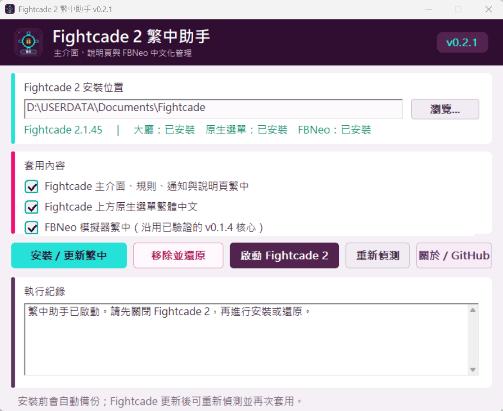
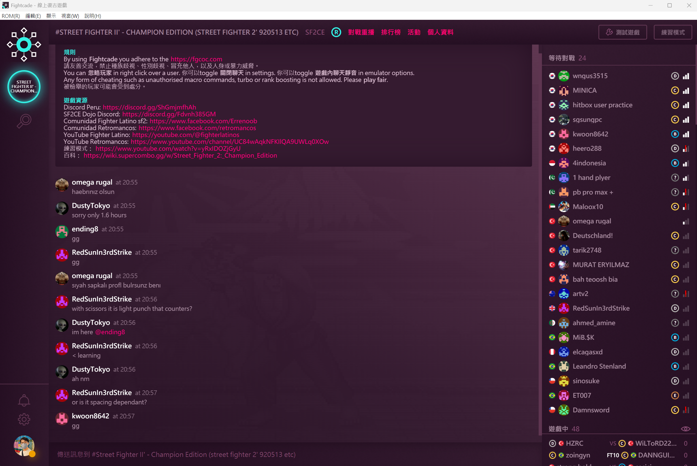
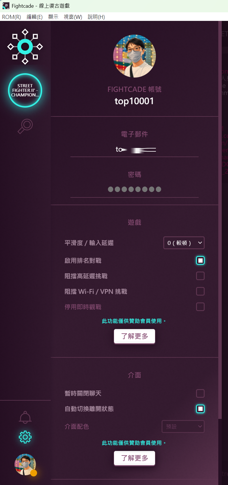
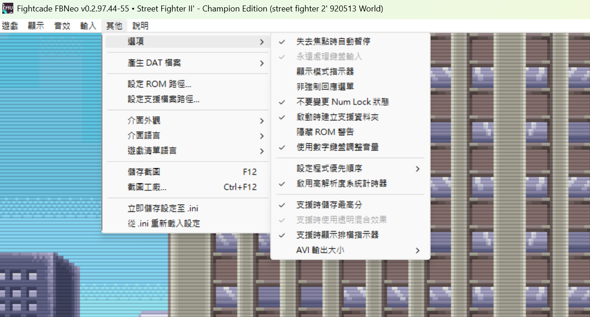

# Fightcade 2 繁中助手

**Fightcade 2 繁體中文化工具**，提供 Fightcade 大廳、規則、通知、帳號設定、上方原生選單，以及 Fightcade FBNeo 模擬器的繁體中文化。

> 本工具為非官方社群作品，與 Fightcade 官方及 FinalBurn Neo 官方沒有直接關係。  
> 此儲存庫提供程式成品、使用說明與畫面預覽，不公開原始碼。

## 主要功能

- Fightcade 2 大廳與固定操作介面繁中
- 遊戲房間規則與通知頁面繁中
- 帳號、前端、挑戰與觀戰相關設定繁中
- Fightcade 上方原生選單繁中
- Fightcade FBNeo 模擬器主要選單與設定視窗繁中
- 自動偵測 Fightcade 安裝位置
- 安裝前自動備份原始檔案
- 支援一鍵移除中文化並還原
- 可在 Fightcade 更新後重新偵測相容狀態

## 下載

請前往本專案的 [Releases](../../releases/latest) 頁面下載最新版：

```text
Fightcade2_zhTW_Helper_v0.2.1.exe
```

目前版本：

```text
v0.2.1
```

## 支援環境

目前已針對下列版本製作及測試：

- Windows 10 / 11 x64
- Fightcade 2.1.45
- Fightcade FBNeo v0.2.97.44-55

Fightcade 或 FBNeo 更新後，介面結構與語言檔格式可能改變。若工具顯示版本不相容，請勿強制套用 FBNeo 中文化，以免造成選單錯位、消失或亂碼。

## 使用方式

1. 下載 `Fightcade2_zhTW_Helper_v0.2.1.exe`。
2. 完全關閉 Fightcade 2 與 Fightcade FBNeo。
3. 執行繁中助手。
4. 確認或選擇 Fightcade 安裝目錄，例如：

   ```text
   D:\USERDATA\Documents\Fightcade
   ```

5. 勾選需要套用的項目：

   - Fightcade 主介面、規則、通知與說明頁繁中
   - Fightcade 上方原生選單繁體中文
   - Fightcade FBNeo 模擬器繁中

6. 按下「安裝／更新繁中」。
7. 完成後按「啟動 Fightcade 2」，或自行重新開啟 Fightcade。

## 移除與還原

1. 完全關閉 Fightcade 2 與 FBNeo。
2. 執行繁中助手。
3. 確認 Fightcade 安裝位置。
4. 按下「移除並還原」。
5. 工具會盡量還原安裝中文化前自動備份的檔案。

建議在 Fightcade 官方更新前先移除中文化，完成官方更新後，再使用「重新偵測」確認相容性。

## 畫面預覽

### 繁中助手介面

提供 Fightcade 安裝位置偵測、繁中安裝、還原、重新偵測及啟動功能。三個中文化項目可依需求分別啟用。



### Fightcade 大廳繁中

將對戰重播、排行榜、活動、個人資料、規則、遊戲資源及其他固定操作介面翻譯為繁體中文。



### 帳號與介面設定繁中

支援 Fightcade 帳號選項、平滑度與輸入延遲、排名對戰、挑戰限制、即時觀戰、通知及前端設定等介面。



### Fightcade FBNeo 模擬器繁中

支援 Fightcade FBNeo 的遊戲、顯示、音效、輸入、按鍵設定、DIP 開關及其他主要功能介面繁中。



## 中文化範圍

可中文化的內容主要為 Fightcade 與 FBNeo 的固定介面文字，例如：

- 按鈕、頁籤與功能選單
- 遊戲房間規則
- 通知與帳號設定
- 挑戰、接受、拒絕與觀戰提示
- FBNeo 模擬器選單與設定視窗

下列內容通常會保留原文：

- 玩家名稱
- 聊天室訊息
- 遊戲正式名稱
- Discord、YouTube、Wiki 等外部網站內容
- 由伺服器臨時提供或更新的文字
- 遊戲 ROM 內的英文畫面

## Fightcade 更新後怎麼處理

Fightcade 主程式版本未變時，官方仍可能更新線上大廳頁面，因此部分新文字可能暫時顯示英文。

更新後建議依序操作：

1. 先用繁中助手「移除並還原」。
2. 完成 Fightcade 官方更新。
3. 開啟繁中助手並按「重新偵測」。
4. 確認 Fightcade 與 FBNeo 版本。
5. 版本相容時再重新套用繁中。

若新版 FBNeo 不相容，請先只套用 Fightcade 主介面與上方選單繁中，等待繁中助手更新。

## 常見問題

### Windows 顯示未知發行者或安全警告

本工具沒有商業程式碼簽章，因此 Windows SmartScreen 或防毒軟體可能顯示提醒。請確認檔案是從本專案的正式 Releases 頁面下載。

### 中文化後部分文字仍是英文

Fightcade 大廳是動態載入的線上介面。官方新增或修改文字後，尚未收錄的項目可能暫時維持英文。

### FBNeo 選單異常、消失或出現亂碼

請立即關閉 FBNeo，使用繁中助手按「移除並還原」。不要將舊版 FBNeo 語言檔強制套用到不同版本的模擬器。

### 更新 Fightcade 後中文化不見了

官方更新可能覆蓋中文化檔案。請先按「重新偵測」，確認相容後再按「安裝／更新繁中」。

## 作者

- 作者：Terence Liu
- GitHub：[@Terence0816](https://github.com/Terence0816)
- 專案名稱：`fightcade2-zh-tw-helper`

## 相關聲明

- 本工具不是 Fightcade 官方產品。
- Fightcade、FinalBurn Neo 及相關名稱與標誌的權利歸各自權利人所有。
- 本工具僅用於提供繁體中文介面與便利的備份、還原功能。
- 請勿將本工具重新封裝、冒名發布或用於商業轉售。
- 第三方元件與相關說明請參閱 [THIRD_PARTY_NOTICES.md](THIRD_PARTY_NOTICES.md)。

## English

Fightcade 2 Traditional Chinese localization helper for the lobby UI, native menus, notifications, account settings, and Fightcade FBNeo.

This is an unofficial community tool and is not affiliated with Fightcade or FinalBurn Neo.
